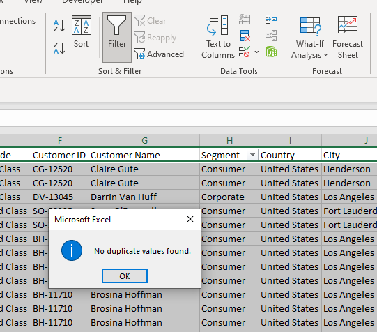
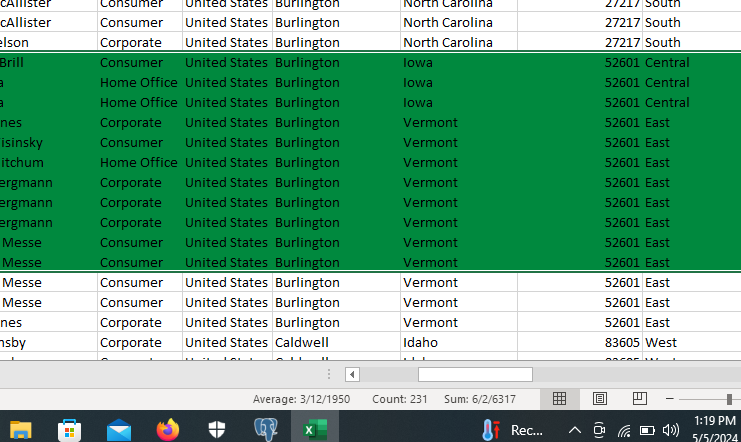
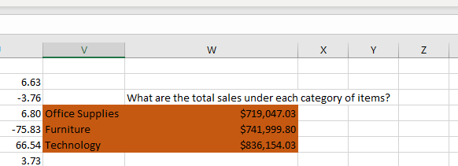
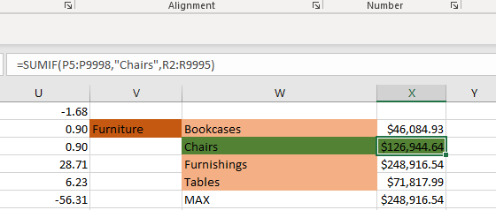
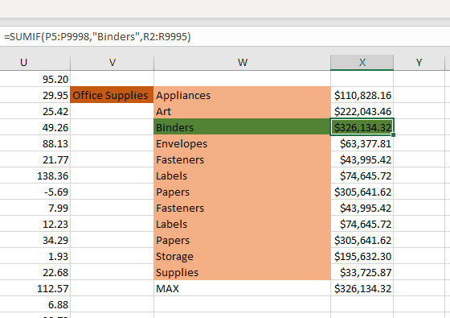
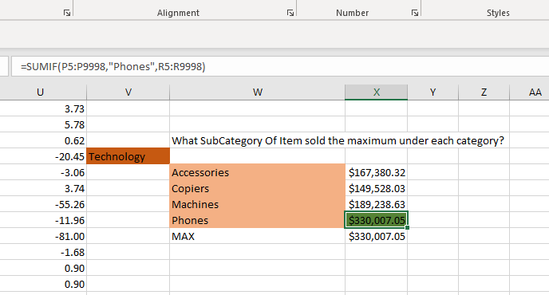
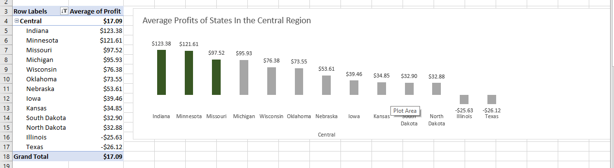
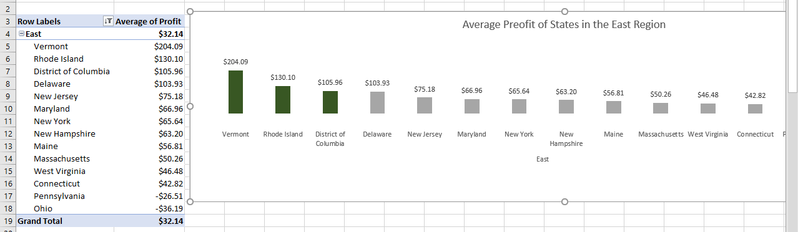
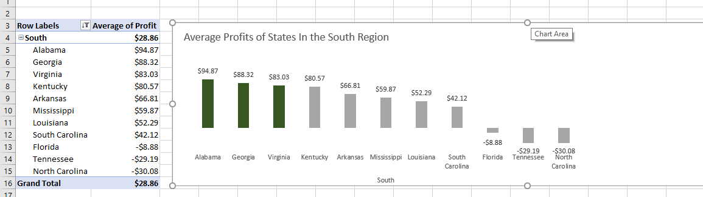

# Introduction
The Super-Store Data Set, each row represents a unique transaction or sale within the store. These rows includes details such as the date of the transaction, the products purchased, quantities, prices. This is a business data containing 9994 rows , 21 columns, each showing the traction of the business, the name of each customer, the unique ID givven to each customer, the amount or quantities bougt, the ship date, every other business transactions between the tear 2015 and 2019 across different state  and citites in the united states.

# Problem Statement
1) What is the total sales under category of items?
2) Which Subcategory of items sold the maximum under each category?
3) Which were the top 3 states from each region that the made the hihest average profit?
4) What is the percentage contribution of each subcategory of products under each category to the total sales?
5) Which customer made the lowest profit in the home segment in each state?
6) Find the sales made in each quarter of 2016 for all the regions. 
7) Find the profit made in each year for all the categories of product in the East and West regions.
   
# Data Cleaning
Step 1: Checked for duplicates first

Step 2: I Checked all coloums for thies Data types

a) I converted the Order Date coloumn from general to date data type

b) I converted the shipping mode coloumn from general to text data type

c)I converted the discount coloumn from general to percentage

d) I converted the sales coloumn from general to currency data type

Step 3: Checking for blank and null values
 There were null values in the postal code coloumn, after studying the pattern of the coloumn, I noticed that every city has a unique postal code. i filled Burlington( The city with blank vlaues ) with its unique postal code
 

# Aswering Business Question
  ## Question 1;  What is the total sales under category of items?
  

Insights: Technology generated more sales compared to other categories. Technology had the highest sales of $836,154.03, Furniture had a total sales of $741,999.80, office supplies had sales of $719,047.

## Question 2: Which Subcategory of items sold the maximum under each category?
 Furniture Category

Insights; The Chairs subcategory boasted the highest sales, totaling an impressive $126,944.64.

Office Supplies Category

Insights: The Binder subcategory boasted the highest sales, totaling an impressive $326,134.32.

Technology Category

Insights: The Phone subcategory boasted the highest sales, totaling an impressive $330,007.05.

## Question 3: Which were the top 3 states from each region that the made the hihest average profit?

Central Region

Insights: The Central region shines with Indiana, Minnesota, and Missouri emerging as the top three states with the highest profits.

East Region

Insights: The East region shines with Vertmont, Rhode Island, and District of coloumbia emerging as the top three states with the highest profits.

South Region

Insights: The East region shines with Alambam, Georgia, Virginia and  emerging as the top three states with the highest profits.

West Region

Insights: The South region shines with Montana, wyoming, and Nevada  emerging as the top three states with the highest profits.

